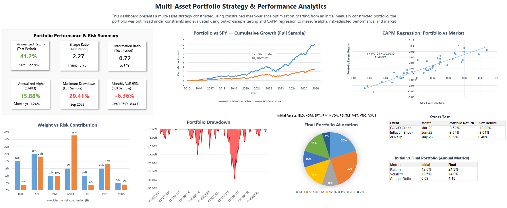

# Portfolio Optimization Analysis

## Project Overview

This project analyzes and improves a manually constructed multi-asset portfolio using constrained mean-variance optimization.

Starting from an initial portfolio allocation, the strategy was optimized under realistic allocation constraints and then evaluated using out-of-sample testing and CAPM regression to measure alpha, risk-adjusted performance, and market exposure.

## Dashboard Preview

## Objectives
- Improve a manually constructed portfolio using constrained mean-variance optimization.
- Evaluate portfolio performance through out-of-sample validation.
- Analyze alpha, market exposure, and downside risk using CAPM and risk metrics.

## Methodology

The project followed a structured multi-step process:

1. Constructed an initial multi-asset portfolio allocation.
2. Examined asset relationships using correlation and beta analysis.
3. Applied constrained mean-variance optimization using Excel Solver.
4. Evaluated the optimized portfolio through out-of-sample testing.
5. Assessed alpha and market exposure using CAPM regression.
6. Analyzed portfolio drivers using return attribution and risk contribution.
7. Examined downside behavior using drawdown, VaR/CVaR, stress testing, and interest-rate sensitivity.

## Key Results

- The optimized portfolio achieved an expected annual return of 21.3% on a full-sample basis, compared with 12.0% for the initial portfolio.
- Sharpe Ratio improved from 0.63 in the initial portfolio to 1.16 in the optimized full-sample portfolio.
- In the out-of-sample test period, the portfolio delivered a 41.2% expected annual return with 13.63% volatility and a Sharpe Ratio of 2.27, compared with 16.4%, 15.11%, and 0.75 in the training period, while also outperforming SPY.
- CAPM regression indicated positive alpha, with an annualized alpha of 15.88% during the test period.
- Risk analysis showed a maximum drawdown of 29.4%, a VaR 95% of -6.36%, and a CVaR 95% of -8.44%, while risk contribution analysis identified NVDA as the largest source of portfolio risk.

